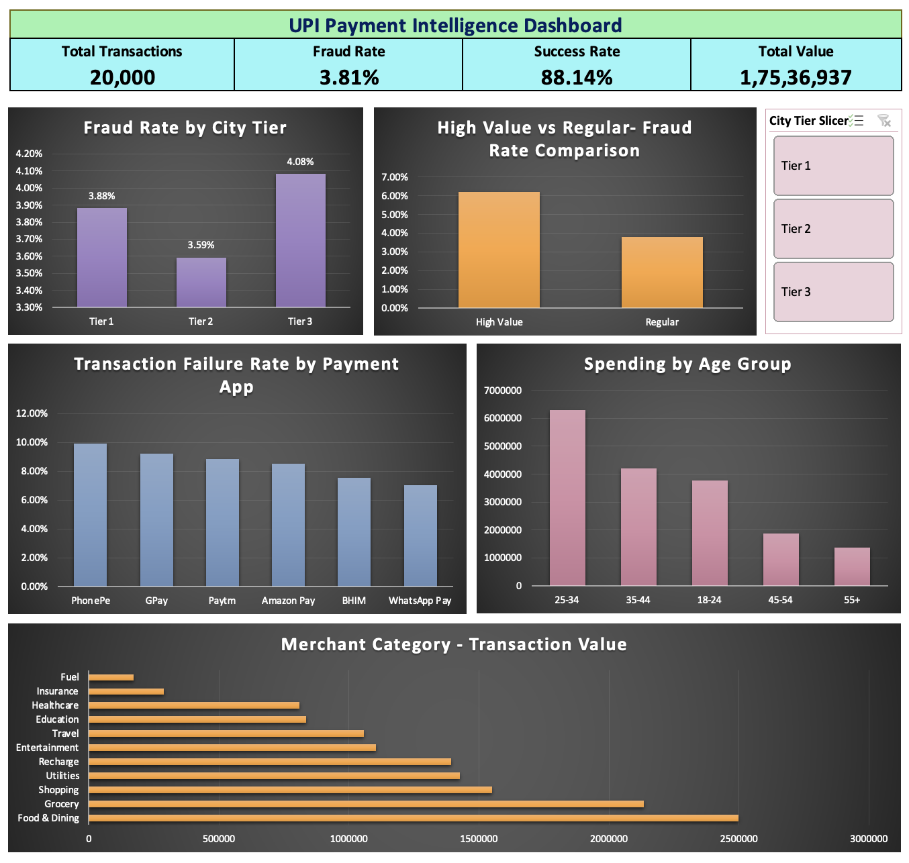

# UPI Payment Intelligence Analysis

## Project Overview
A multi-table payment intelligence system built in PostgreSQL to analyze 
fraud patterns, merchant performance, and user behavior across India's 
UPI ecosystem. Built to solve real fintech business problems using 
20,000 transactions across 4 relational tables.

## Business Questions Solved
1. What is the fraud profile across city tiers, devices, and payment apps?
2. Which merchant categories drive highest transaction volume and value?
3. How does spending behavior differ across age groups and city tiers?
4. What drives transaction failures and what is the operational cost?
5. What is the risk profile of high value transactions?

## Key Findings
- Tier 3 cities have 4.08% fraud rate — 14% higher than Tier 2
- Unverified users show 5.69% fraud rate — 61% higher than verified users
- Food & Dining leads merchant volume at 18.75% share — Rs.24.97 lakh value
- Age 25-34 dominates spending at 35.95% of total value
- Transaction failure rate is 9.08% — below industry benchmark
- High value transactions carry 64% higher fraud rate than regular

## Dashboard



## Tools & Technologies
- Python 3.11 — data cleaning and visualization
- PostgreSQL — relational database and SQL analysis
- Excel — interactive dashboard with pivot tables and slicers
- Pandas, Matplotlib, Seaborn — data processing and charts
- Git/GitHub — version control

## Project Structure

```
UPI-Payment-Intelligence/
├── data/
│   ├── raw/          — original 4 CSV files
│   └── clean/        — cleaned CSVs after Python processing
├── notebooks/
│   ├── 01_data_cleaning.ipynb
│   └── 02_sql_analysis.ipynb
├── sql/
│   ├── db_setup.py
│   └── upi_analysis_queries.sql
└── dashboard/
    └── UPI_Dashboard.xlsx
```

## Dataset
Synthetic UPI transaction dataset from Kaggle simulating India's UPI 
payment ecosystem with realistic fraud signals and merchant metadata.

- transactions.csv — 20,000 rows, 30 columns
- users.csv — 2,000 rows, 13 columns  
- merchants.csv — 400 rows, 9 columns
- fraud_labels.csv — 20,000 rows, 11 columns

## Author
Miraj Rajendra Patil
MCA in Data Science — MIT ADT University

## Connect

- LinkedIn: [linkedin.com/in/mirajpatil](https://linkedin.com/in/mirajpatil)
- GitHub: [github.com/CodeByMiraj](https://github.com/CodeByMiraj)
